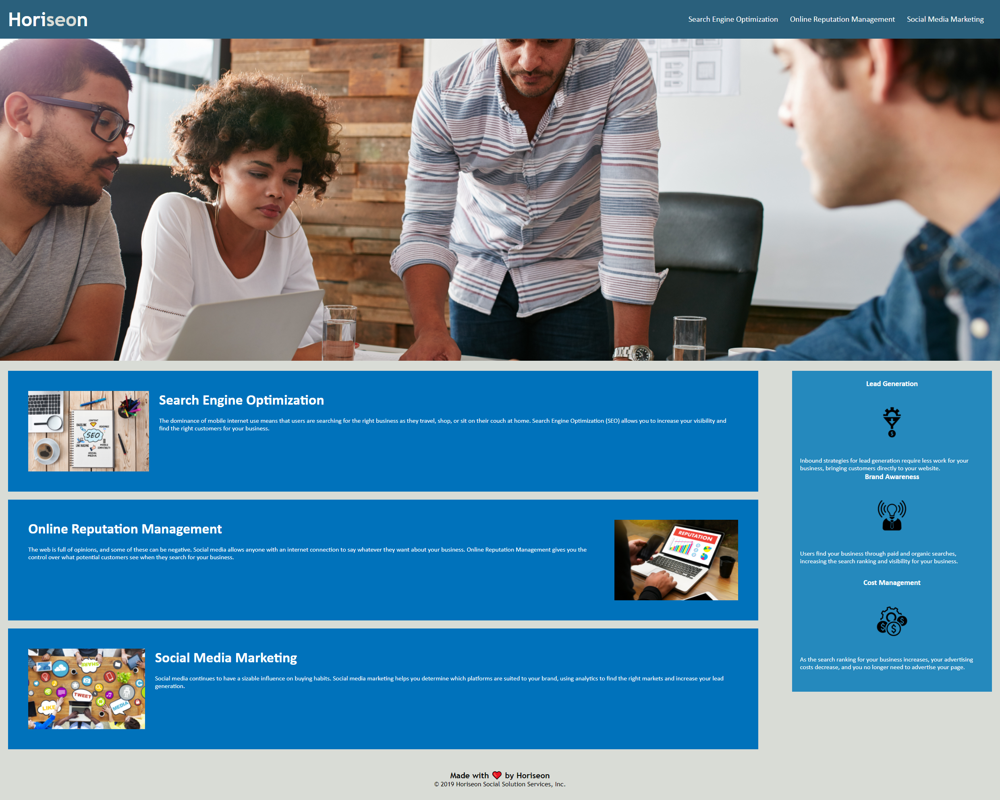
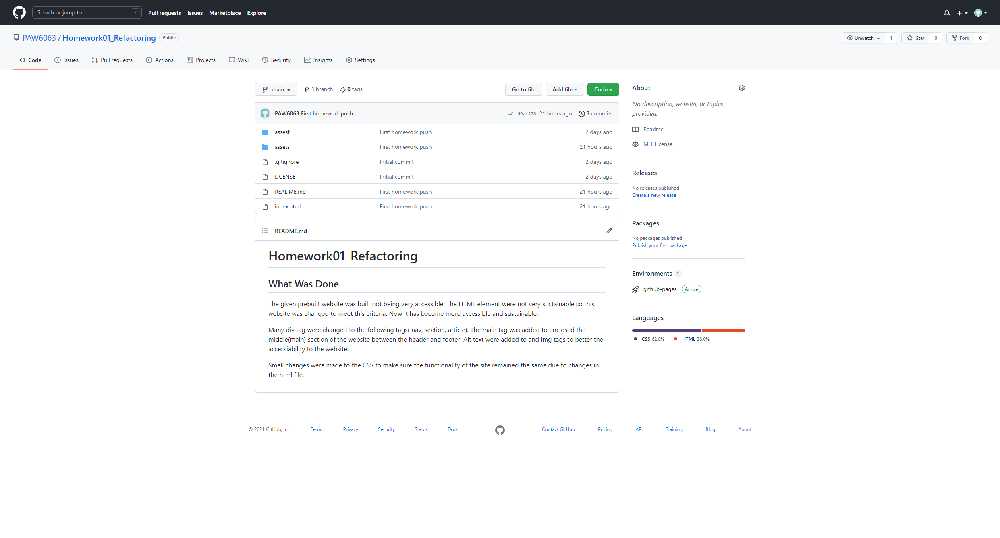

# Refactoring

## What Was Done

The given prebuilt website was built not being very accessible. The HTML element were not very sustainable so this website was changed to meet this criteria. Now it has become more accessible and sustainable.

Many div tag were changed to the following tags( nav, section, article).
The main tag was added to enclosed the middle(main) section of the website between the header and footer.
Alt text were added to and img tags to better the accessiability to the website.

Small changes were made to the CSS to make sure the functionality of the site remained the same due to changes in the html file.

## Pictures

## Links

- https://paw6063.github.io/Homework01_Refactoring/
- https://github.com/PAW6063/Homework01_Refactoring
